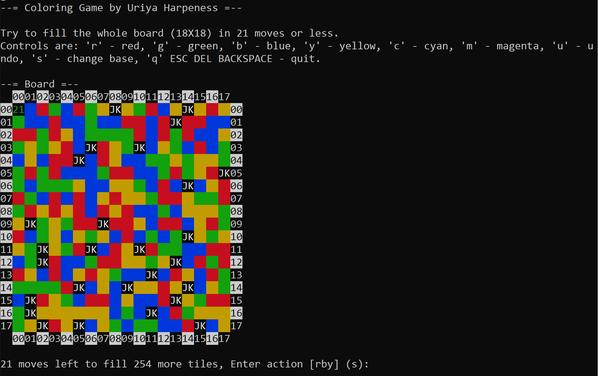
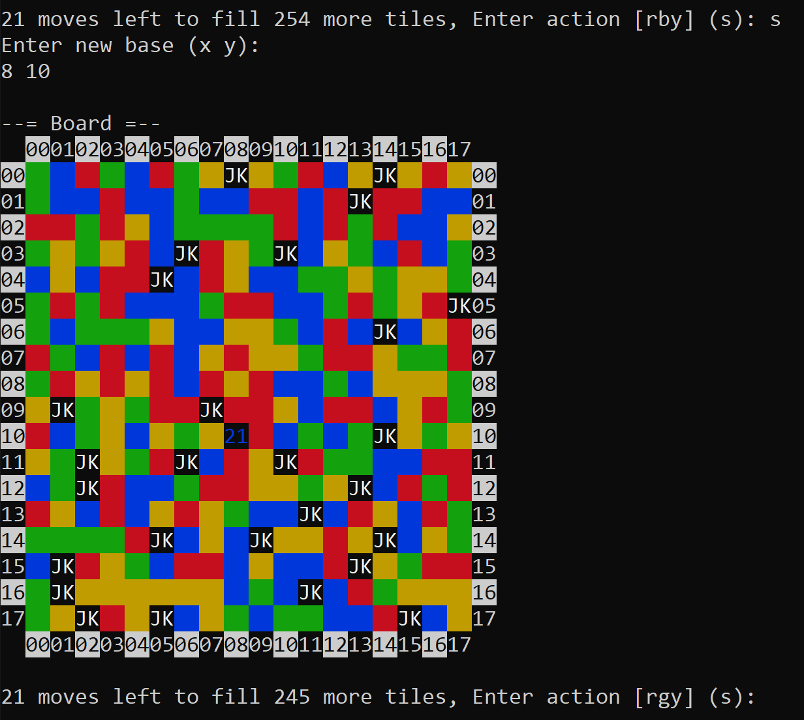
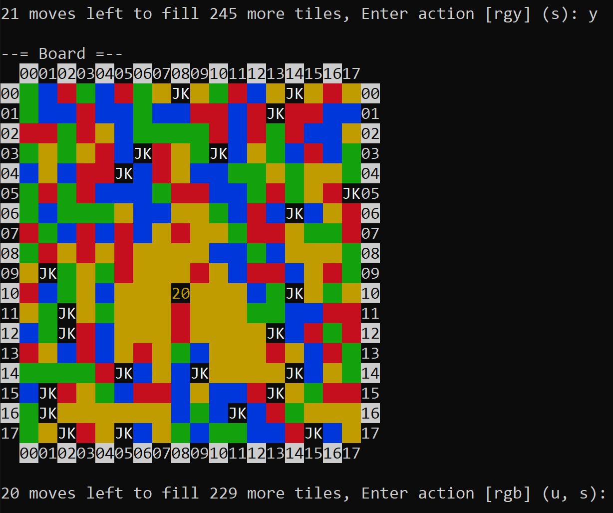
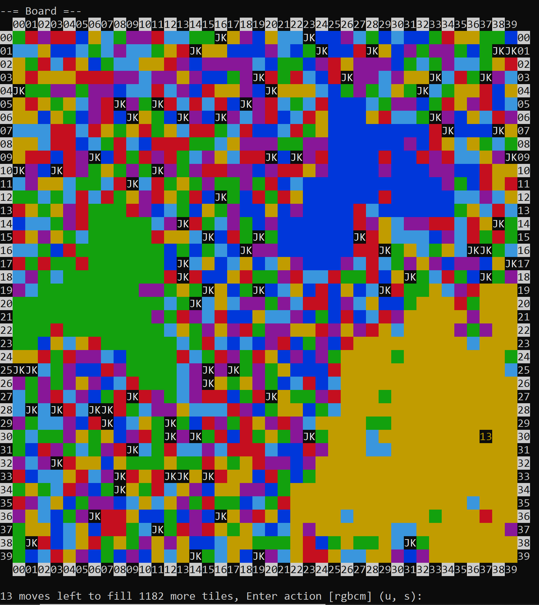

# Coloring Game

Welcome to Coloring Game!

Bored out of your mind? Think you got what it takes to win this game? Want to enjoy a colorful, fun,
not-too-complicated, short, well programmed/documented activity? Got no friends to play with?

Coloring Game is here to the rescue! Configure the game settings - or not - and play away.

## Game Rules

### Goal

Paint the whole board with a single color, before you run out of moves.

### Game Components

* Played with a single player (aka. You).
* The game is played on a rectangle board.
* Each tile on the board contains either a color or a joker.

### Game Setup

* The base's position is set to (0, 0) (leftmost-uppermost).
* The board is filled with random colors and jokers:
  * The joker appearance rate is 1/12.
  * The possible colors are: red, green, blue, yellow, cyan, and magenta.

### Turn Overview

A turn can contain any of the following actions:
* Undo last move ('u') - undo the last move, possible only where previous moves were made.
  * Restores the previous state of the board, including the number of turns (-1).
* Change base ('s') - change the base, where the coloring is performed from.
  * Can be done unlimited times, does not affect the turns count.
* Color ('r', 'g', 'y', 'b', 'm', 'c') - color the base and touching tiles with the same color, recursively.
  * Counts as a turn (+1).
* Quit ('q', ESC, BACKSPACE, DELETE) - quit the game.

#### Coloring

A coloring actions is done from the base position, changes its color, and affects the board is several ways:
1.  Colors are changed recursively, all neighbor tiles in 4 directions (up, down, left, right) with the same color as
    the base are changed, repeating this step, until confronted with a different color.
2.  Tiles in chess knight move positions in relation to the base are colored.
3.  A joker tile that one of its close neighbors in 4 directions (up, down, left, right) changes its color -
    colors its close neighbors in 8 directions (up, up-left, left, left-down, down, down-right, right, right-up)
    regardless of their original color, this may chain more joker triggers.     

### Ending the Game

**Victory** - If the player has filled the entire board with a single color, before running out of moves.

**Defeat** - If the player did not succeed in filling the entire board with a single color, before running out of moves.

**Disqualification** - If the player has quit the game.

### Examples

Let's start a new game, shall we?



Now let's change our base:



And finally, color!



The rest I'm leaving for you to discover, but I will give a sneak peak at what it can be:



## Getting Started

First off clone this project, after that you'll need to install a couple of requirements, and than you'll only need to
build it and enjoy the ride.

### Prerequisites

The packages required for building the project are:
gcc, cmake.

```shell script
apt install gcc cmake
```

### Building

After installing all the requirements, building the project is as straight-forward as it can be.

```
cmake .
make
```

That's it!

### Usage

Coloring Game takes 4 positional arguments, non of which is required, be order: `MOVES`, `WIDTH`, `HEIGHT`, and
`COLOR_NUM`.
* `MOVES` - The moves limit, after which if the game is not solved, it will end in a defeat, the default value is `21`.
* `WIDTH` - The width of the board, must be specified with `HEIGHT`, the default value is `18`.
* `HEIGHT` - The height of the board, must be specified with `WIDTH`, the default value is `18`.
* `COLOR_NUM` - The number of colors to use in the game, must be between 2 and 6, the default value is `4`.

## Technologies and Capabilities

* Coloring Game is written in [C++](https://en.wikipedia.org/wiki/CPP).
* Uses colorful display.
* Quite simple actually... this is a game.

## Documentation

The code is thoroughly documented, using
[LSST DM Developer Guide](https://developer.lsst.io/cpp/api-docs.html#documenting-c-code) format.

I hope that it can answer whichever questions that may arise.

## Contributing

Feel free to contact me if you have any comments, questions, ideas, and anything else you think I should be aware of.

## Authors

* [**Uriya Harpeness**](https://github.com/UriyaHarpeness)

## Acknowledgments

* I would like to thank my wife - Tohar Harpeness, my parents, my computer, and my free time, for enabling me to work on
this small project, it has been fun.
